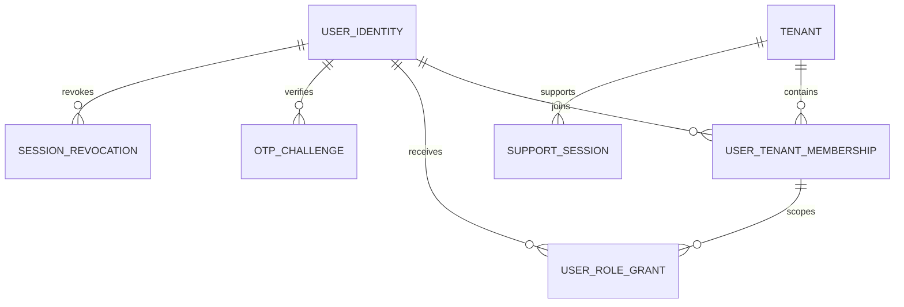
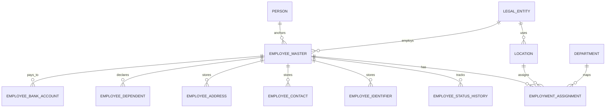
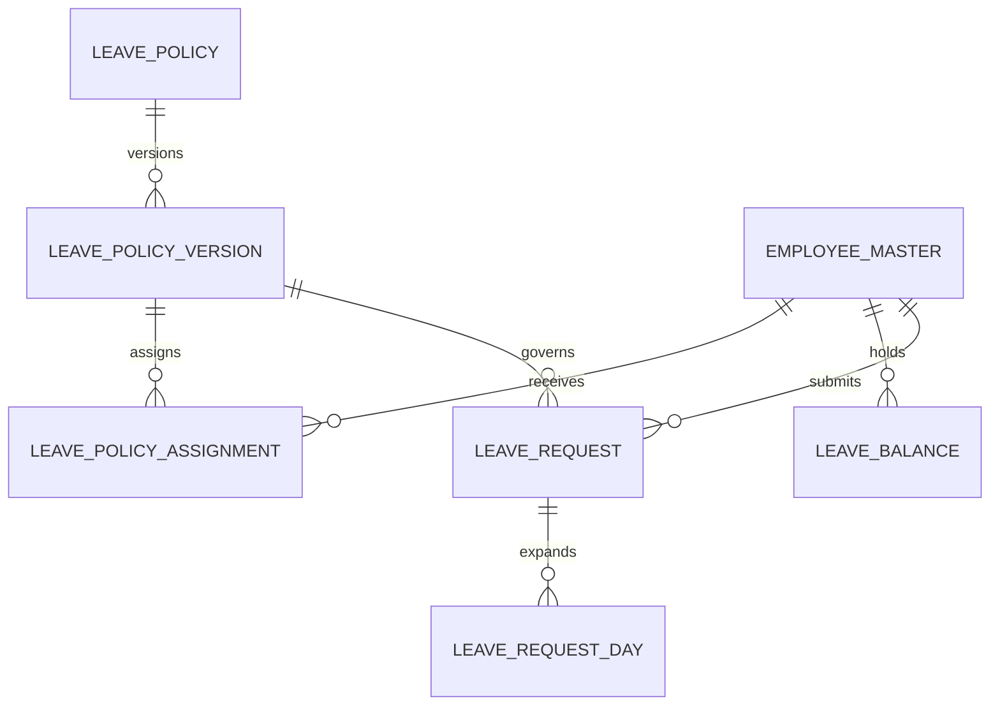
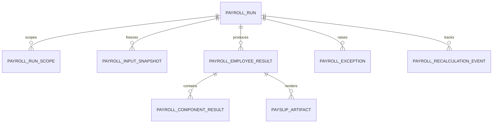
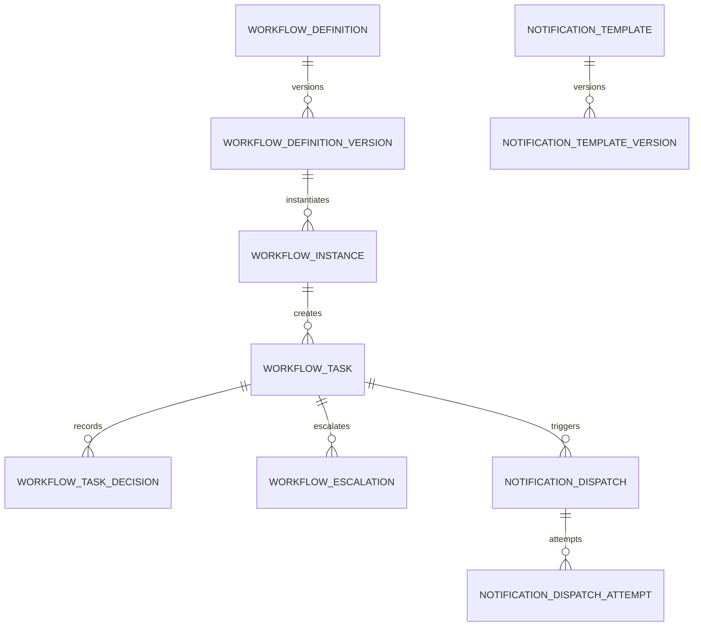

# 1. Purpose

This appendix defines the implementation-facing database baseline for the Enterprise HRMS platform. It is intended to bridge the current gap between module specifications and physical schema design so engineering, QA, architecture, reporting, and implementation teams can work from a common data model.

# 2. Scope

This baseline covers:

- service-aware table ownership
- canonical relational patterns
- mandatory shared columns and control fields
- key, uniqueness, foreign-key, and indexing rules
- soft-delete, audit, temporal, and effective-dating patterns
- row-level security and tenant-isolation expectations
- high-risk ERD starter diagrams for the most reused platform domains

This baseline does not yet replace full service-by-service DDL packs. It is the governing starter layer that future DDL, migrations, ORM models, warehouse mappings, and integration contracts must align to.

# 3. Architecture Position

This document should be read together with:

- `07-entity-ownership-and-module-reference-matrix.md`
- `12-canonical-field-dictionary-seed.md`
- `18-field-validation-standards-and-rule-matrix.md`
- `19-validation-rule-implementation-traceability-matrix.md`
- `08-service-topology-and-deployment-architecture.md`

The intended implementation posture is:

- each deployable domain service owns its write schema and write models
- shared platform services own their own operational schemas
- cross-service reads should prefer APIs, events, materialized projections, or search indexes over direct write-schema joins
- warehouse, analytics, and reporting stores may denormalize, but operational systems of record must preserve canonical ownership

# 4. Global Schema Design Principles

## 4.1 Tenant Isolation

- Every tenant-scoped business table shall store `tenant_id`.
- Tables that can participate in business-date or cutoff logic should also store or resolve `business_timezone`.
- Unique constraints for business identifiers such as `employee_code`, `requisition_code`, `workflow_number`, or `ticket_number` must be tenant-scoped unless explicitly defined as provider-global.
- No query path used by application traffic may depend on implied tenant filtering in application code alone; the platform must support a defense-in-depth model through query helpers, RLS-aware patterns, or equivalent data-access enforcement.

## 4.2 Global and Org Identity

- Every platform or organization user shall have a provider-global identity through `global_user_id`.
- Every tenant-bound identity shall also carry `org_user_id`.
- `global_user_id` and `org_user_id` are not interchangeable.
- Employee, contractor, admin, delegated admin, support-session shadow user, and service-principal actors should be resolvable to the same actor lineage model used by workflow, audit, and notifications.

## 4.3 Write Ownership

- One service owns mutation rights for each canonical table family.
- Other services may cache or project the same facts, but those copies must declare themselves as derived or read-optimized data.
- Cross-service workflows must not silently update another service's write tables outside governed integration contracts.

## 4.4 Immutable vs Mutable Records

- Master entities may be mutable, but high-risk attributes should preserve history through child history or effective-dated tables.
- Workflow decisions, audit records, payroll run snapshots, import preview results, notification delivery attempts, and event publication logs should be append-only or append-mostly.
- Once payroll, audit, workflow decision, or signed document records cross their finalization boundary, mutation should be prohibited except through explicit corrective or reversal structures.

# 5. Logical Schemas and Ownership

The following logical schemas are recommended whether implemented as separate physical schemas or separate bounded-model namespaces:

| Logical Schema | Primary Owner | Core Table Families | Notes |
|---|---|---|---|
| `platform_core` | platform foundation | tenant, plan, subscription, provider config, provider admin, support session | provider-owned, not org HR operations |
| `identity_access` | identity and access service | user identity, login status, role grants, session revocation, MFA, OTP challenge | shared across platform and org personas |
| `org_core` | tenant and org core service | legal entity, business unit, department, location, holiday calendar, org hierarchy | effective-dated where structural changes matter |
| `people_core` | people management service | person, employee master, employment assignment, identifiers, contacts, dependents, bank accounts | central HRMS workforce source of truth |
| `recruitment_core` | recruitment service | requisition, candidate, interview, offer, hiring pipeline | candidate privacy retention required |
| `time_leave` | workforce time plus leave services | attendance, shift, roster, timesheet, leave request, leave balance, leave policy | high business-date sensitivity |
| `payroll_core` | payroll service | payroll run, result, component details, input snapshots, exceptions, statutory outputs | immutable after close controls |
| `performance_talent` | performance and talent service | cycles, goals, reviews, calibrations, succession pools | strong workflow dependency |
| `learning_core` | learning service | courses, enrollments, assignments, completions, certifications | may support external learners later |
| `workflow_core` | workflow and approval service | workflow definition, workflow instance, tasks, task decisions, escalations, delegation | shared multi-module engine |
| `notification_core` | notification service | template, dispatch, attempt, preference, provider callback | channel-aware delivery evidence |
| `document_core` | document and file services | document metadata, document version, binary reference, file scan result, signature envelope | binary objects outside relational store |
| `audit_core` | audit service | audit event, audit actor snapshot, audit object snapshot, export log | append-only evidence store |
| `config_core` | configuration service | config key, scope, value set, publish version, override lineage | scope-aware precedence engine |
| `integration_core` | integration hub | connector, credential reference, sync job, webhook subscription, contract version, dead-letter log | secrets should not live in plain business tables |
| `ops_tooling` | implementation and platform ops | import batch, import row, validation preview, reconciliation issue, job run, retry log | implementation-safe operational support |

# 6. Mandatory Column Standards

## 6.1 Common Base Columns

Unless a table is strictly provider-global or static reference data, the following columns should be considered mandatory:

| Column | Purpose | Notes |
|---|---|---|
| `id` | surrogate primary key | UUID or sortable UUID strongly preferred |
| `tenant_id` | tenant lineage | mandatory for tenant-scoped records |
| `created_at` | creation timestamp | UTC storage |
| `created_by` | creator actor | human or service principal |
| `updated_at` | last change timestamp | UTC storage |
| `updated_by` | last updater actor | align with audit actor where possible |
| `version_no` | optimistic concurrency or version lineage | required for high-conflict tables |
| `correlation_id` | request or process lineage | especially important on async flows |
| `privacy_classification` | masking and export controls | required for restricted data families |

## 6.2 Soft-Delete Columns

Only tables that are designed to support logical deletion should include:

| Column | Purpose |
|---|---|
| `deleted_at` | logical deletion timestamp |
| `deleted_by` | actor who deleted |
| `delete_reason_code` | controlled reason where governance requires |
| `restore_allowed_until` | optional restoration boundary |

Soft-delete rules:

- soft-deleted rows must be excluded from all default operational queries
- uniqueness constraints must account for soft-delete behavior so logically removed rows do not block legitimate re-creation unless policy requires retention lock
- child rows of a soft-deleted parent must follow explicit cascade, detach, archive, or block rules and never rely on accidental orphaning
- append-only tables such as audit logs or workflow decisions should not use soft delete

## 6.3 Effective-Dating Columns

Effective-dated tables should include:

| Column | Purpose |
|---|---|
| `effective_from` | validity start date or timestamp |
| `effective_to` | validity end date or timestamp |
| `change_reason_code` | why a new version was created |
| `superseded_by_id` | linkage to replacement row when applicable |
| `is_current` | optional query convenience flag |

Effective-dating rules:

- date ranges for the same entity and attribute family must not overlap unless explicitly allowed by the model
- `effective_to` null should represent open-ended validity
- recalculated derived fields must not destroy prior effective versions
- payroll-affecting master data should use effective-dated history rather than destructive overwrite

## 6.4 Business-Date and Timezone Columns

Any table used in attendance, leave, payroll cutoffs, or date-sensitive approval logic should explicitly model:

| Column | Purpose |
|---|---|
| `business_date` | business interpretation date |
| `business_timezone` | IANA timezone used for rules |
| `occurred_at_utc` | actual event timestamp in UTC |
| `submitted_local_at` | optional local datetime captured from user context |

Rules:

- business cutoffs must not be computed from server-local time
- the rule engine should resolve business date from tenant, legal entity, or location policy
- leap-day dates such as `29-Feb` must preserve original value and derived-policy behavior separately

# 7. Key and Constraint Standards

## 7.1 Primary Keys

- Use surrogate primary keys for all high-volume operational tables.
- UUID or sortable UUID keys are preferred to reduce collision and coordination issues across services.
- Natural keys such as `employee_code` or `requisition_number` should be modeled as business keys, not physical primary keys.

## 7.2 Business Keys

Examples:

- `tenant_code` unique at provider level
- `org_user_id` unique within `tenant_id`
- `employee_code` unique within `tenant_id`
- `requisition_code` unique within `tenant_id`
- `policy_code` unique within tenant and policy family where applicable

Rules:

- business keys should be immutable once external dependencies exist unless the platform explicitly supports governed renumbering
- business-key uniqueness must define whether soft-deleted rows still reserve the identifier

## 7.3 Foreign Keys

- Enforce foreign keys inside a service boundary unless there is a proven scalability reason not to.
- Across service boundaries, store canonical identifiers and validate through APIs, events, or reference projections rather than cross-database foreign keys.
- Child tables representing historical facts should usually reference the stable parent anchor, not a mutable current-state row only.

## 7.4 Optimistic Concurrency

The following table families should use optimistic concurrency through `version_no` or equivalent record hash:

- employee master and high-risk child records
- workflow tasks
- leave requests
- payroll run control tables
- config entries
- document metadata
- support-session or impersonation controls

This is required to protect against:

- double-submit on approve or submit actions
- stale browser tabs
- parallel admin edits
- background-job replay after manual correction

# 8. Indexing Standards

## 8.1 Required Baseline Indexes

Every high-traffic tenant table should have:

- primary key index on `id`
- composite index starting with `tenant_id`
- status plus date index where workflow or dashboard filtering is common
- `created_at` or `updated_at` index for reconciliation and support workflows

## 8.2 Recommended Composite Patterns

| Pattern | Example Use |
|---|---|
| `tenant_id, status_code` | inboxes, queues, pending work |
| `tenant_id, employee_id` | employee child entity retrieval |
| `tenant_id, business_date` | attendance, leave, payroll calendars |
| `tenant_id, effective_from, effective_to` | effective-dated lookup |
| `tenant_id, manager_worker_id, status_code` | manager dashboards |
| `tenant_id, correlation_id` | tracing and support |
| `tenant_id, source_system_code, source_record_key` | import and sync reconciliation |
| `tenant_id, deleted_at` | soft-delete-aware filtered indexes |

## 8.3 Search and Text Strategy

- Free-text search should not rely on unbounded `%like%` queries for enterprise-scale lists.
- Cross-entity search should route through a search service or indexed projection.
- Limited in-table text indexes may exist for targeted use cases such as document tags, policy names, or ticket subjects, but must remain tenant-filterable.

# 9. Privacy, Encryption, and Masking

## 9.1 Classification Tiers

Suggested operational classes:

- `Internal`
- `Confidential`
- `Restricted`
- `Highly Restricted`

## 9.2 Encryption Expectations

The following data families should be encrypted at rest with field-level protection or tokenization where feasible:

- Aadhaar and equivalent national identifiers
- PAN and tax identifiers where local law requires special handling
- bank account numbers and routing details
- passport identifiers and supporting document references
- payroll results and high-risk compensation components where policy requires
- secrets, connector credentials, OTP artifacts, and signed URL backing references

## 9.3 Masking Rules

- masked fields must never be written in clear text to audit payload summaries, operational logs, or notification templates
- support and export tooling must respect privacy classification
- document metadata may be viewable while binary retrieval remains separately authorized

# 10. Table Family Baseline

## 10.1 Platform and Tenant Foundation

Core tables:

- `tenant`
- `tenant_subscription`
- `tenant_domain`
- `tenant_status_history`
- `provider_admin_user`
- `support_session`

Key design notes:

- provider-side platform admin dashboards should only read these platform-operational tables plus cross-tenant metrics projections
- no HR transactional tables such as leave requests or requisitions should be treated as native platform-admin write scope unless a governed support flow exists
- tenant lifecycle states should be separated from user login states

## 10.2 Identity and Access

Core tables:

- `user_identity`
- `user_tenant_membership`
- `user_role_grant`
- `permission_override`
- `otp_challenge`
- `session_revocation`
- `delegated_access_grant`

Key design notes:

- `global_user_id` unique globally
- `org_user_id` unique within tenant
- exited or suspended workforce users must have login eligibility driven from identity tables plus employment event reactions, not from UI convention alone
- OTP challenges should be short-lived and stored separately from the trusted final profile field they authorize

## 10.3 Organization Core

Core tables:

- `legal_entity`
- `business_unit`
- `department`
- `location`
- `cost_center`
- `org_hierarchy_edge`
- `holiday_calendar`

Key design notes:

- use adjacency plus optional closure or path strategy for hierarchy traversal
- effective-dated hierarchy edges are preferred where reporting lineage changes over time
- legal entities and locations should carry default `business_timezone` and `country_code`

## 10.4 People Core

Core tables:

- `person`
- `employee_master`
- `employment_assignment`
- `employee_status_history`
- `employee_identifier`
- `employee_contact`
- `employee_address`
- `employee_dependent`
- `employee_bank_account`
- `employee_document_link`
- `employee_source_mapping`

Key design notes:

- `person` should outlive employee or contractor lifecycle changes
- `employee_master` should represent the employment anchor for the tenant context
- assignment, manager, department, legal entity, and payroll-impacting changes should be historical
- dependent plausibility and age-based validation rules should be implemented both in DTO validation and persistence safeguards
- only one active payout bank account should exist per employee per effective business date unless country-specific multi-account payout is enabled

## 10.5 Recruitment Core

Core tables:

- `job_requisition`
- `candidate`
- `candidate_application`
- `interview_schedule`
- `offer_record`
- `offer_approval_snapshot`

Key design notes:

- candidate privacy retention and consent lineage are mandatory
- requisition and offer status transitions should be workflow-safe and non-free-text
- accepted offers should create traceable onboarding and people-master handoff artifacts

## 10.6 Time and Leave

Core tables:

- `attendance_record`
- `attendance_correction_request`
- `shift_definition`
- `roster_assignment`
- `timesheet_entry`
- `leave_policy`
- `leave_policy_version`
- `leave_policy_assignment`
- `leave_balance`
- `leave_request`
- `leave_request_day`

Key design notes:

- attendance and leave should persist both actual timestamps and business-date interpretation
- leave requests spanning multiple days should usually have child day rows for holiday, half-day, and sandwich-rule precision
- leave balance must preserve debit-credit ledger behavior rather than only storing a mutable current balance
- policy publication versions must be immutable once activated

## 10.7 Payroll Core

Core tables:

- `payroll_run`
- `payroll_run_scope`
- `payroll_input_snapshot`
- `payroll_employee_result`
- `payroll_component_result`
- `payroll_exception`
- `payroll_recalculation_event`
- `payslip_artifact`

Key design notes:

- payroll input snapshots should preserve exact values used at process time
- gross-to-net results should be immutable for a finalized run version
- recalculation should create a new result lineage path, not overwrite prior approved evidence
- statutory and bank output artifacts should reference the run version that produced them

## 10.8 Workflow and Approvals

Core tables:

- `workflow_definition`
- `workflow_definition_version`
- `workflow_instance`
- `workflow_task`
- `workflow_task_decision`
- `workflow_escalation`
- `workflow_delegation`

Key design notes:

- tasks should be append-mostly with decision history preserved even if a current-state convenience column exists
- stale actions must be protected by object version checks
- parallel approval branches should be modeled explicitly rather than inferred from status text

## 10.9 Notifications

Core tables:

- `notification_template`
- `notification_template_version`
- `notification_dispatch`
- `notification_dispatch_attempt`
- `notification_preference`
- `provider_delivery_callback`

Key design notes:

- separate template definition from dispatch execution
- each dispatch may have multiple channel attempts
- provider callbacks should reconcile to dispatch attempt IDs

## 10.10 Documents and Files

Core tables:

- `document_record`
- `document_version`
- `file_binary_reference`
- `file_scan_result`
- `signature_envelope`
- `document_access_grant`

Key design notes:

- relational data should store metadata and control fields, not large binaries
- file size, MIME type, scan state, retention class, and signed URL eligibility should all be explicit
- document references from modules should point to stable metadata IDs

## 10.11 Audit and Operations Tooling

Core tables:

- `audit_event`
- `audit_object_snapshot`
- `import_batch`
- `import_batch_row`
- `import_preview_issue`
- `job_run`
- `job_retry_attempt`
- `dead_letter_record`

Key design notes:

- import processing must stage rows before commit
- every import row should preserve source row number, preview status, field errors, and reconciliation outcome
- durable jobs need independent retry and dead-letter evidence

# 11. ERD Starter Diagrams

## 11.1 Tenant, Identity, and Membership

## 11.2 Organization and People Core

## 11.3 Leave Policy, Balance, and Request

## 11.4 Payroll Run and Results

## 11.5 Workflow and Notifications

# 12. Service-Aware Table Reference Matrix

| Table Family | Primary Service | Mutation Rights | Cross-Service Read Pattern | Notes |
|---|---|---|---|---|
| tenant and subscription | tenant and org core | exclusive | API and metrics projection | provider-managed |
| user identity and memberships | identity and access | exclusive | token claims, API, security projections | shared across personas |
| org hierarchy | tenant and org core | exclusive | API, cache, event projection | high reuse across modules |
| employee and assignment | people core | exclusive | API, events, read models | central workforce truth |
| requisitions and candidates | recruitment | exclusive | API, events, analytics model | privacy retention critical |
| attendance and shifts | workforce time | exclusive | API, projections, payroll input feed | high-volume transactional |
| leave policies, balances, requests | leave service | exclusive | API, projections, payroll input feed | policy versioning required |
| payroll runs and results | payroll service | exclusive | API, export artifacts, analytics feed | immutable after close |
| workflow instances and tasks | workflow service | exclusive | inbox API, event stream | shared engine |
| notification dispatch and attempts | notification service | exclusive | delivery API, audit feed | channel evidence retained |
| document metadata | document and file services | exclusive | signed retrieval APIs and references | object store externalized |
| audit events | audit service | exclusive | audit explorer and export API | append-only |
| config entries | configuration service | exclusive | config resolver API and cache | precedence-aware |
| import batches and job runs | ops tooling or job service | exclusive | admin API and support dashboards | not a domain system of record |

# 13. Row-Level Security and Data Access Model

## 13.1 Required Access Dimensions

Operational data access should be enforceable by one or more of:

- `tenant_id`
- legal entity scope
- business unit or department scope
- manager or reporting scope
- role and permission grant
- state-aware restriction such as draft versus published versus archived
- support-session or delegated-access control flags

## 13.2 Enforcement Expectations

- data-access helpers must inject tenant scope by default
- privileged cross-tenant support access must be time-bound, justified, and audited
- exports and reports must apply the same scope rules as screen queries
- search indexes and analytics extracts must preserve security trimming metadata

# 14. Lifecycle, Retention, and Archival

## 14.1 Retain in Operational Store

Usually retained live:

- active employee and organization masters
- open workflow tasks
- current leave balances
- current configuration versions
- active document metadata

## 14.2 Archive or Partition Candidates

Candidates for partitioning, cold storage, or archive strategies:

- attendance history
- notification dispatch attempts
- audit events
- import row previews
- payroll result detail across many closed periods
- historical workflow evidence

## 14.3 Retention Rules

- retention and purge behavior must respect statutory, contractual, audit, and litigation-hold requirements
- purge should be policy-driven and service-owned, not a generic blind cleanup job
- privacy deletion requests should operate through governed anonymization or deletion workflows where labor-law retention still applies

# 15. Migration and ORM Guidance

## 15.1 Migration Rules

- every structural migration must be backward-compatible with rolling deployments unless explicitly approved otherwise
- destructive column drops should be deferred until all dependent code paths and exports are retired
- data backfills must be idempotent and restart-safe

## 15.2 ORM Model Guidance

- ORM convenience relations must not blur service ownership boundaries
- base models should standardize common control columns
- high-risk enums should be centrally governed so API contracts, DTOs, and DB models do not drift

# 16. Open Gaps to Close Next

The following follow-on artifacts should be derived from this baseline:

- service-by-service physical table catalogs
- per-table column dictionaries with exact data types and nullable rules
- index and partition DDL recommendations by service
- RLS policy examples for tenant, manager, and support-session access
- encryption key-management and tokenization control design
- warehouse lineage map from operational tables to analytics marts

# 17. Build Rules Summary

- no module may invent alternate ownership for canonical high-risk tables without architecture approval
- no tenant-scoped business table should omit `tenant_id`
- no high-risk workflow action should rely on last-write-wins without concurrency control
- no import should write directly into production business tables without preview and validation staging
- no file metadata model should ignore MIME type, file size, scan result, and retention class
- no payroll, workflow decision, or audit evidence should be destructively overwritten
